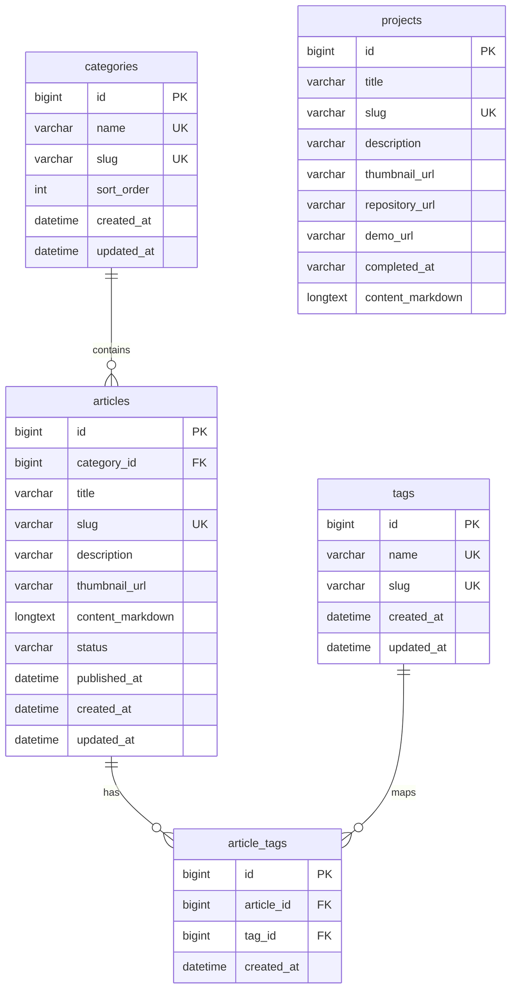

# ERD Definition

개인 개발 블로그 MVP 기준 ERD 정의서입니다.

## Overview

핵심 목표:

* 게시글을 DB에 저장하고 관리한다.
* 프로젝트 포트폴리오를 DB에 저장하고 관리한다.
* 게시글은 카테고리 1개와 여러 태그를 가질 수 있다.
* 블로그 소유자만 게시글과 프로젝트를 작성, 수정, 삭제할 수 있다.
* 방문자는 현재 읽기만 가능하며, 별도 사용자 계정을 만들지 않는다.
* 관리자 인증은 별도 `users` 테이블을 두지 않고, Spring Security 설정과 환경변수 기반 계정으로 처리한다.
* Markdown 원문은 DB에 저장하고, 조회 시 HTML로 렌더링한다.
* 댓글, 좋아요, 이미지 파일 테이블은 MVP 이후 확장 대상으로 둔다.

## Entities

```text
categories
tags
articles
article_tags
projects
```

## Relationship

```text
categories 1 ── N articles
articles N ── N tags
articles 1 ── N article_tags
tags 1 ── N article_tags
```

## Mermaid ERD



## Table Definitions

### categories

게시글 카테고리입니다. 게시글은 하나의 카테고리에 속할 수 있습니다.

| Column     | Type        | Null | Key | Description |
| ---------- | ----------- | ---- | --- | ----------- |
| id         | BIGINT      | N    | PK  | 카테고리 ID     |
| name       | VARCHAR(50) | N    | UK  | 카테고리 이름     |
| slug       | VARCHAR(80) | N    | UK  | URL 식별자     |
| sort_order | INT         | N    |     | 정렬 순서       |
| created_at | DATETIME    | N    |     | 생성일         |
| updated_at | DATETIME    | N    |     | 수정일         |

### tags

게시글 태그입니다. 게시글은 여러 태그를 가질 수 있습니다.

| Column     | Type        | Null | Key | Description |
| ---------- | ----------- | ---- | --- | ----------- |
| id         | BIGINT      | N    | PK  | 태그 ID       |
| name       | VARCHAR(50) | N    | UK  | 태그 이름       |
| slug       | VARCHAR(80) | N    | UK  | URL 식별자     |
| created_at | DATETIME    | N    |     | 생성일         |
| updated_at | DATETIME    | N    |     | 수정일         |

### articles

블로그 게시글 테이블입니다.

작성자는 별도 사용자 테이블로 관리하지 않습니다.
이 블로그는 개인 개발 블로그이므로 게시글 작성자는 블로그 소유자 1명으로 고정됩니다.

| Column           | Type          | Null | Key | Description                     |
| ---------------- | ------------- | ---- | --- | ------------------------------- |
| id               | BIGINT        | N    | PK  | 게시글 ID                          |
| category_id      | BIGINT        | Y    | FK  | 카테고리 ID                         |
| title            | VARCHAR(200)  | N    |     | 제목                              |
| slug             | VARCHAR(220)  | N    | UK  | URL 식별자                         |
| description      | VARCHAR(500)  | Y    |     | 목록/SEO 설명                       |
| thumbnail_url    | VARCHAR(1000) | Y    |     | 대표 이미지 URL                      |
| content_markdown | LONGTEXT      | N    |     | Markdown 원문                     |
| status           | VARCHAR(30)   | N    |     | `DRAFT`, `PUBLISHED`, `PRIVATE` |
| published_at     | DATETIME      | Y    |     | 발행일                             |
| created_at       | DATETIME      | N    |     | 생성일                             |
| updated_at       | DATETIME      | N    |     | 수정일                             |

### article_tags

게시글과 태그의 다대다 관계를 풀기 위한 매핑 테이블입니다.

게시글 하나는 여러 태그를 가질 수 있고, 태그 하나는 여러 게시글에 연결될 수 있습니다.

| Column     | Type     | Null | Key | Description |
| ---------- | -------- | ---- | --- | ----------- |
| id         | BIGINT   | N    | PK  | 매핑 ID       |
| article_id | BIGINT   | N    | FK  | 게시글 ID      |
| tag_id     | BIGINT   | N    | FK  | 태그 ID       |
| created_at | DATETIME | N    |     | 생성일         |

Unique constraint:

```text
UNIQUE(article_id, tag_id)
```

### projects

포트폴리오 프로젝트 테이블입니다.

개인 프로젝트, 학습 프로젝트, 공모전 프로젝트, 리팩토링 프로젝트 등의 기록을 저장합니다.

| Column           | Type          | Null | Key | Description            |
| ---------------- | ------------- | ---- | --- | ---------------------- |
| id               | BIGINT        | N    | PK  | 프로젝트 ID                |
| title            | VARCHAR(200)  | N    |     | 프로젝트 제목                |
| slug             | VARCHAR(220)  | N    | UK  | URL 식별자                |
| description      | VARCHAR(500)  | Y    |     | 프로젝트 요약                |
| thumbnail_url    | VARCHAR(1000) | Y    |     | 대표 이미지 URL             |
| repository_url   | VARCHAR(1000) | Y    |     | GitHub URL             |
| demo_url         | VARCHAR(1000) | Y    |     | 배포/데모 URL              |
| completed_at     | VARCHAR(7)    | Y    |     | 개발 완료 시점, 예: `2026.05` |
| content_markdown | LONGTEXT      | Y    |     | 상세 설명 Markdown         |

## Enum Candidates

### ArticleStatus

```text
DRAFT
PUBLISHED
PRIVATE
```

## Indexes

추천 인덱스:

```text
articles.slug
articles.status
articles.published_at
articles.category_id
categories.slug
tags.slug
projects.slug
projects.completed_at
article_tags.article_id
article_tags.tag_id
```

검색 기능을 단순 LIKE로 시작할 경우:

```text
articles.title
articles.description
```

MySQL full-text search를 사용할 경우:

```text
FULLTEXT(title, description, content_markdown)
```

## Admin Authentication Policy

MVP에서는 관리자 계정을 DB에 저장하지 않습니다.

관리자 인증은 다음 방식으로 처리합니다.

```text
Spring Security
환경변수 또는 application-secret.yml
BCrypt password
/admin/** URL 접근 제한
```

예시:

```text
ADMIN_USERNAME=admin
ADMIN_PASSWORD={bcrypt}...
```

관리자만 접근 가능한 기능:

```text
/admin/articles/new
/admin/articles/{id}/edit
/admin/projects/new
/admin/projects/{id}/edit
```

## Future Extension: Comments

댓글 기능은 MVP 이후 확장 대상으로 둡니다.

방문자 회원가입은 만들지 않고, 익명 닉네임과 비밀번호를 입력해 댓글을 남기는 방식을 고려합니다.

추후 댓글 기능을 추가할 경우 예상 테이블은 다음과 같습니다.

```text
comments
```

예상 관계:

```text
articles 1 ── N comments
```

예상 테이블 구조:

```text
comments {
    bigint id PK
    bigint article_id FK
    varchar nickname
    varchar password_hash
    text content
    varchar status
    datetime created_at
    datetime updated_at
}
```

### comments

| Column        | Type         | Null | Key | Description                    |
| ------------- | ------------ | ---- | --- | ------------------------------ |
| id            | BIGINT       | N    | PK  | 댓글 ID                          |
| article_id    | BIGINT       | N    | FK  | 게시글 ID                         |
| nickname      | VARCHAR(50)  | N    |     | 댓글 작성자 닉네임                     |
| password_hash | VARCHAR(255) | N    |     | 댓글 수정/삭제용 비밀번호 해시              |
| content       | TEXT         | N    |     | 댓글 내용                          |
| status        | VARCHAR(30)  | N    |     | `VISIBLE`, `HIDDEN`, `DELETED` |
| created_at    | DATETIME     | N    |     | 생성일                            |
| updated_at    | DATETIME     | N    |     | 수정일                            |

댓글 기능 추가 시 Enum 후보:

```text
VISIBLE
HIDDEN
DELETED
```

## Notes

* `users` 테이블은 MVP에서 사용하지 않습니다.
* 블로그 작성자는 서비스 사용자로 모델링하지 않습니다.
* 관리자 인증은 DB Entity가 아닌 Spring Security 설정으로 처리합니다.
* 방문자는 별도 계정을 만들지 않습니다.
* 목차는 DB에 저장하지 않습니다.
* 상세 조회 시 `content_markdown`에서 heading을 추출해 `TocItem` 목록을 생성합니다.
* Markdown HTML은 DB에 저장하지 않고 렌더링 시 생성하는 것을 기본으로 합니다.
* 성능 문제가 생기면 `content_html` 캐시 컬럼 추가를 검토합니다.
* 댓글, 좋아요, 이미지 파일 테이블은 MVP 이후 확장 대상으로 둡니다.
