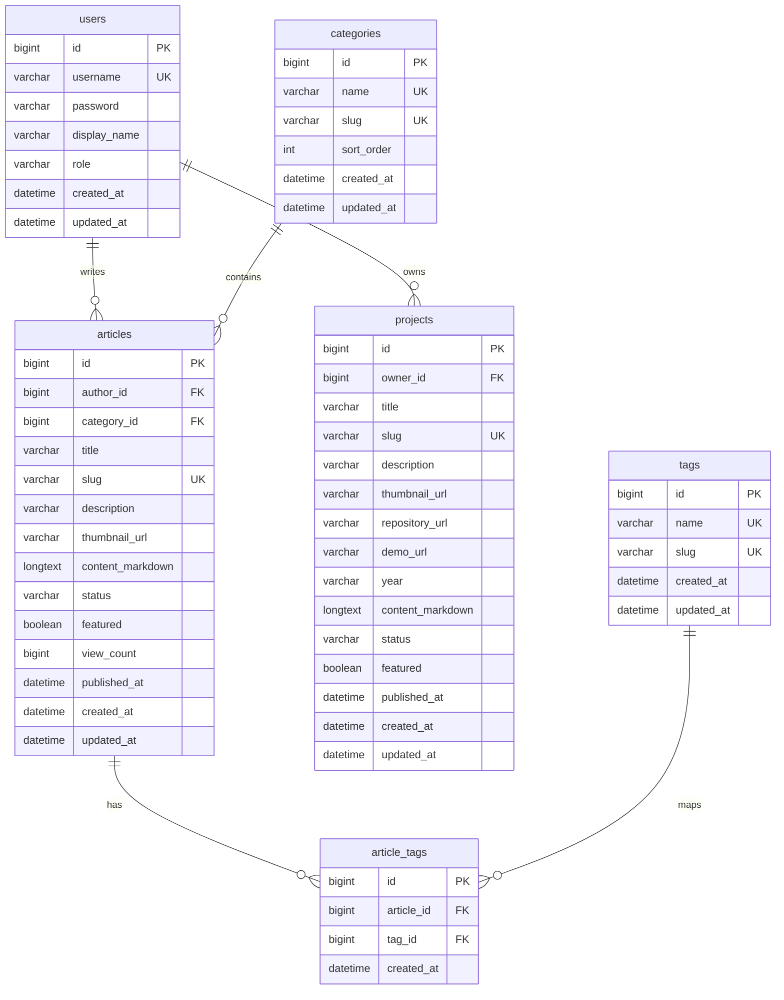

# ERD Definition

개인 개발 블로그 MVP 기준 ERD 정의서입니다.

## Overview

핵심 목표:

- 게시글을 DB에 저장하고 관리한다.
- 프로젝트 포트폴리오를 DB에 저장하고 관리한다.
- 게시글은 카테고리 1개와 여러 태그를 가질 수 있다.
- 관리자 계정으로 글과 프로젝트를 CRUD한다.
- Markdown 원문은 DB에 저장하고, 조회 시 HTML로 렌더링한다.

## Entities

```text
users
categories
tags
articles
article_tags
projects
```

## Relationship

```text
users 1 ── N articles
categories 1 ── N articles
articles N ── N tags
articles 1 ── N article_tags
tags 1 ── N article_tags
users 1 ── N projects
```

## Mermaid ERD



## Table Definitions

### users

관리자 계정 테이블입니다. MVP에서는 관리자 1명만 사용해도 됩니다.

| Column | Type | Null | Key | Description |
| --- | --- | --- | --- | --- |
| id | BIGINT | N | PK | 사용자 ID |
| username | VARCHAR(50) | N | UK | 로그인 ID |
| password | VARCHAR(255) | N |  | BCrypt 암호화 비밀번호 |
| display_name | VARCHAR(50) | N |  | 화면 표시 이름 |
| role | VARCHAR(30) | N |  | `ROLE_ADMIN` |
| created_at | DATETIME | N |  | 생성일 |
| updated_at | DATETIME | N |  | 수정일 |

### categories

게시글 카테고리입니다. 게시글은 하나의 카테고리에 속합니다.

| Column | Type | Null | Key | Description |
| --- | --- | --- | --- | --- |
| id | BIGINT | N | PK | 카테고리 ID |
| name | VARCHAR(50) | N | UK | 카테고리 이름 |
| slug | VARCHAR(80) | N | UK | URL 식별자 |
| sort_order | INT | N |  | 정렬 순서 |
| created_at | DATETIME | N |  | 생성일 |
| updated_at | DATETIME | N |  | 수정일 |

### tags

게시글 태그입니다. 게시글은 여러 태그를 가질 수 있습니다.

| Column | Type | Null | Key | Description |
| --- | --- | --- | --- | --- |
| id | BIGINT | N | PK | 태그 ID |
| name | VARCHAR(50) | N | UK | 태그 이름 |
| slug | VARCHAR(80) | N | UK | URL 식별자 |
| created_at | DATETIME | N |  | 생성일 |
| updated_at | DATETIME | N |  | 수정일 |

### articles

블로그 게시글 테이블입니다.

| Column | Type | Null | Key | Description |
| --- | --- | --- | --- | --- |
| id | BIGINT | N | PK | 게시글 ID |
| author_id | BIGINT | N | FK | 작성자 ID |
| category_id | BIGINT | Y | FK | 카테고리 ID |
| title | VARCHAR(200) | N |  | 제목 |
| slug | VARCHAR(220) | N | UK | URL 식별자 |
| description | VARCHAR(500) | Y |  | 목록/SEO 설명 |
| thumbnail_url | VARCHAR(1000) | Y |  | 대표 이미지 URL |
| content_markdown | LONGTEXT | N |  | Markdown 원문 |
| status | VARCHAR(30) | N |  | `DRAFT`, `PUBLISHED`, `PRIVATE` |
| featured | BOOLEAN | N |  | 추천글 여부 |
| view_count | BIGINT | N |  | 조회수 |
| published_at | DATETIME | Y |  | 발행일 |
| created_at | DATETIME | N |  | 생성일 |
| updated_at | DATETIME | N |  | 수정일 |

### article_tags

게시글과 태그의 다대다 매핑 테이블입니다.

| Column | Type | Null | Key | Description |
| --- | --- | --- | --- | --- |
| id | BIGINT | N | PK | 매핑 ID |
| article_id | BIGINT | N | FK | 게시글 ID |
| tag_id | BIGINT | N | FK | 태그 ID |
| created_at | DATETIME | N |  | 생성일 |

Unique constraint:

```text
UNIQUE(article_id, tag_id)
```

### projects

포트폴리오 프로젝트 테이블입니다.

| Column | Type | Null | Key | Description |
| --- | --- | --- | --- | --- |
| id | BIGINT | N | PK | 프로젝트 ID |
| owner_id | BIGINT | N | FK | 소유자 ID |
| title | VARCHAR(200) | N |  | 프로젝트 제목 |
| slug | VARCHAR(220) | N | UK | URL 식별자 |
| description | VARCHAR(500) | Y |  | 프로젝트 요약 |
| thumbnail_url | VARCHAR(1000) | Y |  | 대표 이미지 URL |
| repository_url | VARCHAR(1000) | Y |  | GitHub URL |
| demo_url | VARCHAR(1000) | Y |  | 배포/데모 URL |
| year | VARCHAR(10) | Y |  | 프로젝트 연도 |
| content_markdown | LONGTEXT | Y |  | 상세 설명 Markdown |
| status | VARCHAR(30) | N |  | `DRAFT`, `PUBLISHED`, `PRIVATE` |
| featured | BOOLEAN | N |  | 추천 프로젝트 여부 |
| published_at | DATETIME | Y |  | 공개일 |
| created_at | DATETIME | N |  | 생성일 |
| updated_at | DATETIME | N |  | 수정일 |

## Enum Candidates

### ArticleStatus / ProjectStatus

```text
DRAFT
PUBLISHED
PRIVATE
```

### UserRole

```text
ROLE_ADMIN
```

## Indexes

추천 인덱스:

```text
articles.slug
articles.status
articles.published_at
articles.category_id
articles.featured
categories.slug
tags.slug
projects.slug
projects.status
projects.published_at
projects.featured
article_tags.article_id
article_tags.tag_id
```

검색 기능을 단순 LIKE로 시작할 경우:

```text
articles.title
articles.description
```

MySQL full-text search를 사용할 경우:

```text
FULLTEXT(title, description, content_markdown)
```

## Notes

- 목차는 DB에 저장하지 않습니다.
- 상세 조회 시 `content_markdown`에서 heading을 추출해 `TocItem` 목록을 생성합니다.
- Markdown HTML은 DB에 저장하지 않고 렌더링 시 생성하는 것을 기본으로 합니다.
- 성능 문제가 생기면 `content_html` 캐시 컬럼 추가를 검토합니다.
- 댓글, 좋아요, 이미지 파일 테이블은 MVP 이후 확장 대상으로 둡니다.
